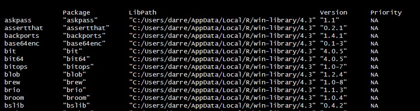

# Welcome to Darrell Wolfe's R_Analysis Code Base

```{r echo = TRUE}
print("Hello, World!") # Welcome to my corner of the digi-verse.
```

This document exists to

1.  Practice using RStudio,

2.  Practice using RMarkdown (both the style and file-type),

3.  To document my process of learning R and create a future-reference resource, and

4.  To preserve the best of my understanding and resources for my friends who are also learning R (now and in the future).

Checkout the [RStudio RMarkdown Cheat Sheet](https://www.rstudio.com/wp-content/uploads/2015/02/rmarkdown-cheatsheet.pdf), which I referenced while creating this document.

*This link was created with the code below:*

```{r echo = TRUE}
  [Checkout the RMarkdown Cheat Sheet](https://www.rstudio.com/wp-content/uploads/2015/02/rmarkdown-cheatsheet.pdf) 
  # Inside a Doc.R document, use: Ctrl + (Mouse Left Click)
```

------------------------------------------------------------------------

## This is a basic intro to R, I will be creating the following:

*All of this is subject to change. I started writing these in .R and now I'm writing in RMarkdown.* \*

-   Learn_R_ref_Intro_to.R - That's where you are now

-   Learn_R_ref_Resources.html - This will be links to Videos, Blogs, and Websites about R

-   Learn_R_ref_Basics_of.R - This will be covering the very basic elements of R syntax, vocabulary, etc.

-   Learn_R_4_Packages\_.R - Information on important or interesting packages I find along the way.

-   Learn_R_ref_HowTo_TBC -

*Interesting - To create that list, I used an asterisk, which is what RMarkdown Cheat Sheet suggested. It didn't take. When I wrote it in the Visual vs Source, using the buttons, and went back to the code, it showed a new format. This can happen when updates come through.*

This is what I used:

```{r echo = FALSE}

# This is what I used:
* Learn_R_ref_Intro_to.R - That's where you are now
* Learn_R_ref_Resources.html - This will be links to Videos, Blogs, and Websites about R
* Learn_R_ref_Basics_of.R - This will be covering the very basic elements of R syntax, vocabulary, etc.
* Learn_R_4_Packages\_.R - Information on important or interesting packages I find along the way.
* Learn_R_ref_HowTo_TBC -
```

This is what it was corrected to:

```{r echo = FALSE}

# This is what it was corrected to:
-   Learn_R_ref_Intro_to.R - That's where you are now

-   Learn_R_ref_Resources.html - This will be links to Videos, Blogs, and Websites about R

-   Learn_R_ref_Basics_of.R - This will be covering the very basic elements of R syntax, vocabulary, etc.

-   Learn_R_4_Packages\_.R - Information on important or interesting packages I find along the way.

-   Learn_R_ref_HowTo_TBC -

```

------------------------------------------------------------------------

## Training

I'm creating this as I'm learning R through Coursera. For information on the course I'm taking to kick-off this project:

#### Coursera

[Data Analysis with R Programming](https://www.coursera.org/learn/data-analysis-r/home/welcome)

```{r echo = TRUE}
[Data Analysis with R Programming](https://www.coursera.org/learn/data-analysis-r/home/welcome) 

```

#### Other Resources

I will also be implementing strategies I find from any helpful resources, including the native help documentation, YouTube videos, TikTok posts, articles, and of course: GPT-4! I'll link to anything I find that is useful.

One perfect example of a resource is the YouTube video: "[Learn R in 39 minutes](https://www.youtube.com/watch?v=yZ0bV2Afkjc "YouTube: Learn R in 39 minutes")" by Equitable Equations. This video was comprehensive but not too long. The last portion of the video informed me about RMarkdown documents (which I'm using to write this now). Definitely subscribe to his channel.

With all that established, let's get to learning R.

------------------------------------------------------------------------

## What is "R"?

To get started on this reference guide, I asked ChatGPT-4 to summarize.

#### BACKGROUND OF R per GPT-4:

The "R" in R programming doesn't officially stand for anything. The language was named "R" by its creators, Ross Ihaka and Robert Gentleman, from the University of Auckland, New Zealand. It can be viewed as a play on their names' initial letter.

However, the language is also considered as an implementation of the S programming language, so sometimes "R" is referred to as a sort of play on the name "S".

S was created by John Chambers and colleagues at Bell Laboratories.

R has become a go-to language for statistical computing and graphics, widely used among statisticians and data analysts.


------------------------------------------------------------------------

## I assume you are using RStudio Desktop:

IF you are reading this in RStudio Cloud / Posit Cloud or in GitHub or online in some way...but you want to use this reference guide to follow along and repeat the processes in your own, you will really want RStudio. While you can use RStudio Cloud/Posit Cloud, the native desktop environment is good to use and get used to.

*If you are a GitHub user and you're not reading this there, my profile is [darrellwolfe](https://github.com/darrellwolfe "GitHub_darrellwolfe"), and my repository for this project is [R_Analysis](https://github.com/darrellwolfe/R_Analysis "GitHub_R_Analysis").*

If you choose to download, you will want to install both: 1. R - That is the code and operating system information you need running in the background. 2. RStudio - That is the Graphic User Interface (GUI) that you will primarily interact with.

------------------------------------------------------------------------

#### Download: [Download_R_And_RStudio_Here](https://posit.co/download/rstudio-desktop/)

```{r echo = TRUE}
#### Download: [Download_R_And_RStudio_Here](https://posit.co/download/rstudio-desktop/)
# Inside a Doc.R document, use: Ctrl + (Mouse Left Click)
```


------------------------------------------------------------------------

## RStudio Desktop Overview


------------------------------------------------------------------------

## SYSTEM INFORMATION

To run code, place cursor in the same line as the code, press Ctrl+Enter (or, click "Run" icon at the top right of the .R docment box). Additionally, highlight multiple lines of code and then do either of the above.

In your session of RStudio (or RStudio Cloud) type:

To see which version of RStudio you are on, type 'version' (without the quotes) place cursor in the same line as the code, press Ctrl+Enter. You should get a result like this:

```{r echo = FALSE}
version
```

------------------------------------------------------------------------

## RStudio Tour

------------------------------------------------------------------------

## PACKAGES

*There are thousands!*

Packages are built either by Posit directly or by various third parties and users. One of the (if not the) first packages you will install is "tidyverse", which has become an industry standard package, providing several functionalities that are used frequently.

Packages come with datasets, new functionality, and other items. \# In some rare cases, packages can come with conflicting functions (meaning two packages could assign the same name to different functions within the package), but most of this is circumvented by which library you have loaded.

### Install a Package

On your machine, run the following:

install.packages("tidyverse") \# then Ctrl+Enter

You should see this:

```{r echo = FALSE}
install.packages("tidyverse") # You can place your cursor anywhere on this line and it would run in your RStudio

```

### Installed Packages

To see which packages are already installed, place cursor in the same line as the code, press Ctrl+Enter: installed.packages()

```{r echo= FALSE}
installed.packages() #Ctrl+Enter}



```

The print out is long on installed.packages, but it will tell you every package you have on your system.


To install packages, place cursor in the same line as the code, press Ctrl+Enter: \# This is the first package you should install, it is one of the first everyone installs after the basic load-in. install.packages("tidyverse")

To load the library from installed packages, place cursor in the same line as the code, press Ctrl+Enter: \# This is your first installed library, you will use this often. More on that later. library(tidyverse)

## Libraries

Once packages are installed, they are on your machine unless you delete them. However, the individual functions of any given package won't be available unless you load them into the current session. Consider each R file-type "Document_Name.R" to be a new blank slate.

Once you load the library, those functions and datasets are available to use within the session. This may be the first thing you want to do after naming your .R file.

### library() as a function

You will load the packages you want to use by using "library".

*Note: CAPITAL vs lowercase matters in R. library() \<is not equal to\> Library()*

Example:

Library(tidyverse) #Ctrl+Enter \# This probably gives you an error.

vs

library(tidyverse) #Ctrl+Enter \# This probably works.

```{r echo = FALSE}
library(tidyverse) #Ctrl+Enter

```

# The Basics of R

\# Here are the things you NEED to know to get started. \# This won't be comprehensive, just an overview of the basic syntax, vocab, etc. \# MAC vs PC - I am going to say Ctrl+, if you use Mac, you know to use Command instead.

# 1. RUN (or EXCUTE) COMMANDS

\# A. To run a command, place your cursor in the line of code \# (or highlight if multiple lines) \# B. Press Ctrl+Enter (or Command+Enter for Mac) \# Except website links, for those [Ctrl+(Left Click with Mouse)]

\# Example: print("Hello, World!") \# Cursor on this line, Press Ctrl+Enter

# 2. COMMENTS

\# \<- That hash-tag/number sign (\#) is a comment marker, R ignores everything after Comments #, ##, ###, installed.packages() #Comments can come after live code too! Click here() then Ctrl+Enter

# 3. WHERE is stuff?

\# Top Left - xxx - This text-box-area you're reading in right now is the xxxx \# You may have several files/windows open at once, writing code in each. \# You can have files/windows of different types (R, SQL, HTML, Text, VBA, etc.) open at once. \# If you use Ctrl+F - a Find and Replace capability will work just like it does in Word or Excel. \# If you run the following three in order, \# the "view" function will open a tab in this section of RStudio

```         
library(tidyverse) # Cursor on this line, Press Ctrl+Enter
library("palmerpenguins") # Cursor on this line, Press Ctrl+Enter
view(penguins) # Cursor on this line, Press Ctrl+Enter
```

\# Bottom Left - Console - Below in the "Console" area. \# Commands can be typed directly into the console too; however, they don't get saved that way. \# Commands may give a Warning or Error, read those. \# Command outputs show in the console, that is its primary function. \# NOTE: Commands ARE case sensitive library() and Library() are not the same.

\# Top Right - \# Environment - This will tell you which libraries and datasets you have open (loaded) \# History - This will tell you what you have been doing. \# Connections - If you have a live connection to the database, you can see that here. \# Git (if a GitHub project is loaded) - \# To create a new Project with an existing GitHub repo, \# DO: File \> New Project \> Version Control \> Git (then paste link from GitHub) \# To open an existing Project \# DO: File \> Open Project (navigate to the folder, click on the "NameOfFile.R" file) \# Tutorials - will walk you through the basics of R.

\# Bottom Right - \# Files - Lets you navigate all the files on your PC. \# Note: You can import a .csv or .xls file from this section. \# DO: Navigate to file from within the Files window, right click file, "Import" \# Plots - This is where your visuals will appear once you create them. \# Packages - Lists your packages, click the name to read about the package. \# Link will load in the Help tab. \# Help - Type a "?" in front of any command or name, run the command, info will appear in Help. ?library(tidyverse) \# Cursor on this line, Press Ctrl+Enter ?tidyverse \# Cursor on this line, Press Ctrl+Enter

# 4. BASIC FUNCTIONALITY

```         
# At base level, it can operate like a scientific calculator

1+1 # Cursor on this line, Press Ctrl+Enter (repeat for each line going-forward)
    # Below in the Console, you should see [1] 2
      # [1] - First line of code
      # 2 - The Answer to 1+1

2*18 # Try this, should see 36
  # [1] 36

# Variables
  # When assigning variables, give it a name of one letter or more.
    # Never start a variable with a number (1Name) but numbers can come after (Name_1)
  # Assign variables using Arrow, Line (<-). 
  # Equals sign (=) works, but don't use it for technical reasons that come up later.
  # Note: If you actually want to have something equal something use double equals signs (==)
    # Example: (x == y)

# Playing with Variables

x <- 10 # Run this, it is now stored as long as you have this session open
        # See the Environment window to the left to see what x is now.

5 * x # Now run this.
  # [1] 50

y <- c(2,4,6,8) #This is a vector, run this
  
x * y # Now run this. 
  # [1] 20 40 60 80
```

# TO BE CONTINUED...
